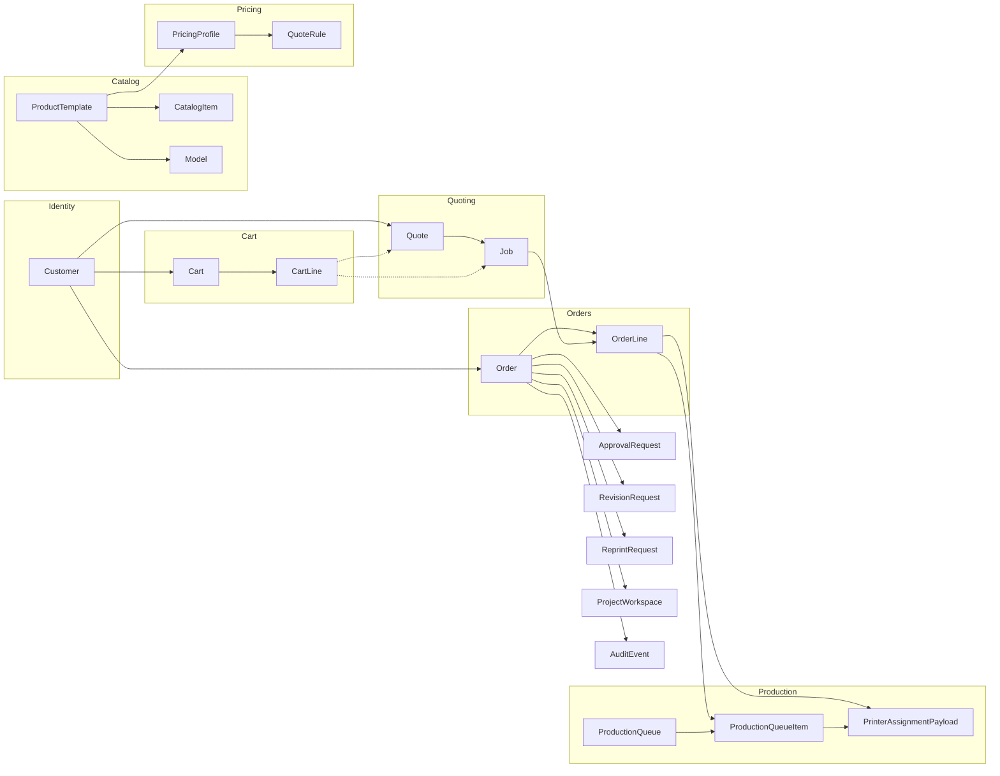

# Database overview

PostgreSQL via Prisma. Source of truth: [backend/prisma/schema.prisma](../backend/prisma/schema.prisma).

## Domains

- **Identity:** Customer
- **Catalog:** CatalogItem, ProductTemplate, Model
- **Quoting:** Quote, Job
- **Cart:** Cart, CartLine
- **Orders:** Order, OrderLine
- **Pricing:** PricingProfile, QuoteRule
- **Payment config:** PaymentMethodConfig
- **Production:** ProductionQueue, ProductionQueueItem, PrinterAssignmentPayload
- **Order support:** ApprovalRequest, RevisionRequest, ReprintRequest, ProjectWorkspace, PinnedPartComment, AuditEvent

---

## Model summary

### Customer

- **Purpose:** Registered user; owns orders, quotes, and carts.
- **Key fields:** `id` (UUID), `email` (unique), `password`, `name`, `createdAt`, `updatedAt`.
- **Relations:** One-to-many `orders`, `quotes`, `carts`.

### CatalogItem

- **Purpose:** Sellable product or “upload my file” entry; used for storefront and quote entry.
- **Key fields:** `id`, `slug` (unique), `name`, `description`, `productTemplateId` (optional FK), `featured`, `sortOrder`, `active`, `imageUrl`, `createdAt`, `updatedAt`.
- **Relations:** Many-to-one `productTemplate` (ProductTemplate, optional).

### ProductTemplate

- **Purpose:** Admin-defined template; drives catalog items, models, and pricing profiles.
- **Key fields:** `id`, `name`, `description`, `active`, `createdAt`, `updatedAt`.
- **Relations:** One-to-many `models`, `catalogItems`, `pricingProfiles`.

### Model

- **Purpose:** 3D model file metadata linked to a product template.
- **Key fields:** `id`, `productTemplateId`, `fileKey`, `format`, `displayName`, `createdAt`.
- **Relations:** Many-to-one `productTemplate` (ProductTemplate).

### Quote

- **Purpose:** Snapshot of one or more jobs with pricing; draft or locked when added to cart.
- **Key fields:** `id`, `sessionId`, `customerId` (optional), `status` (draft | locked), `totalPrice`, `currency`, `validUntil`, `createdAt`, `updatedAt`.
- **Relations:** Many-to-one `customer` (Customer, optional); one-to-many `jobs`.

### Job

- **Purpose:** Single quoted unit (options, quantity, unit price); belongs to a quote, then optionally to an order line after checkout.
- **Key fields:** `id`, `quoteId`, `orderLineId` (optional), `materialId`, `qualityId`, `toleranceClassId`, `quantity`, `turnaroundProfileId`, `unitPrice`, `feasibilityStatus`, `leadTimeDays`, `createdAt`, `updatedAt`.
- **Relations:** Many-to-one `quote` (Quote), many-to-one `orderLine` (OrderLine, optional).

### Cart

- **Purpose:** Session- or customer-scoped container of cart lines (locked quote jobs).
- **Key fields:** `id`, `sessionId`, `customerId` (optional), `createdAt`, `updatedAt`.
- **Relations:** Many-to-one `customer` (Customer, optional); one-to-many `lines` (CartLine).

### CartLine

- **Purpose:** One line per locked job in the cart; references quote and job by id, stores locked price.
- **Key fields:** `id`, `cartId`, `quoteId`, `jobId`, `quantity`, `lockedUnitPrice`, `currency`.
- **Relations:** Many-to-one `cart` (Cart).

### Order

- **Purpose:** Post-checkout record; payment method/state, lifecycle stage, customer or guest.
- **Key fields:** `id`, `orderNumber` (unique), `customerId` (optional), `guestEmail` (optional), `paymentMethod`, `paymentState`, `lifecycleStage`, `createdAt`, `updatedAt`.
- **Relations:** Many-to-one `customer` (Customer, optional); one-to-many `lines`, `approvalRequests`, `revisionRequests`, `reprintRequests`, `auditEvents`, `projectWorkspaces`.

### OrderLine

- **Purpose:** One line per job in an order; snapshot of options and price at checkout.
- **Key fields:** `id`, `orderId`, `jobId`, `snapshot` (JSON), `quantity`, `lineTotal`, `createdAt`.
- **Relations:** Many-to-one `order` (Order); one-to-many `jobs` (Job), `queueItems` (ProductionQueueItem), `printerAssignments` (PrinterAssignmentPayload).

### PricingProfile

- **Purpose:** Admin-defined profile for quote rules (material/quality/turnaround → price, feasibility, lead time).
- **Key fields:** `id`, `name`, `productTemplateId` (optional), `active`, `createdAt`, `updatedAt`.
- **Relations:** Many-to-one `productTemplate` (ProductTemplate, optional); one-to-many `rules` (QuoteRule).

### QuoteRule

- **Purpose:** One rule per profile: conditions (material, quality, etc.) → unitPrice, currency, feasibilityRule, leadTimeDays, optional min/max quantity.
- **Key fields:** `id`, `pricingProfileId`, `materialId`, `qualityId`, `toleranceClassId`, `turnaroundProfileId`, `unitPrice`, `currency`, `feasibilityRule`, `leadTimeDays`, `minQuantity`, `maxQuantity`, `materialRecommendations`.
- **Relations:** Many-to-one `pricingProfile` (PricingProfile).

### PaymentMethodConfig

- **Purpose:** Admin toggle and config per payment method (e.g. stripe, paypal, quote_request).
- **Key fields:** `id`, `method` (unique), `enabled`, `sortOrder`, `configJson`, `updatedAt`.
- **Relations:** None (standalone config table).

### ProductionQueue

- **Purpose:** Named queue for production items (e.g. by printer or stage).
- **Key fields:** `id`, `name`, `active`, `createdAt`, `updatedAt`.
- **Relations:** One-to-many `items` (ProductionQueueItem).

### ProductionQueueItem

- **Purpose:** One order line in a queue; links to optional printer-assignment payload.
- **Key fields:** `id`, `queueId`, `orderLineId`, `status`, `printerAssignmentId` (optional), `createdAt`, `updatedAt`.
- **Relations:** Many-to-one `queue` (ProductionQueue), many-to-one `orderLine` (OrderLine), many-to-one `printerAssignment` (PrinterAssignmentPayload, optional).

### PrinterAssignmentPayload

- **Purpose:** JSON payload for production (e.g. for a Bambu connector); created per order line for “prepare” flow.
- **Key fields:** `id`, `orderLineId`, `payload` (JSON), `status`, `createdAt`, `updatedAt`.
- **Relations:** Many-to-one `orderLine` (OrderLine); one-to-many `queueItems` (ProductionQueueItem).

### ApprovalRequest

- **Purpose:** Customer approval request for an order (e.g. design approval).
- **Key fields:** `id`, `orderId`, `requestedAt`, `dueAt`, `status`, `customerResponseAt`, `customerNotes`, `adminNotes`, `createdAt`, `updatedAt`.
- **Relations:** Many-to-one `order` (Order).

### RevisionRequest

- **Purpose:** Revision request for an order or order line.
- **Key fields:** `id`, `orderId`, `orderLineId` (optional), `type`, `customerNotes`, `status`, `fulfillmentNotes`, `createdAt`, `updatedAt`.
- **Relations:** Many-to-one `order` (Order).

### ReprintRequest

- **Purpose:** Reprint request for an order or order line.
- **Key fields:** `id`, `orderId`, `orderLineId` (optional), `type`, `customerNotes`, `status`, `fulfillmentNotes`, `createdAt`, `updatedAt`.
- **Relations:** Many-to-one `order` (Order).

### ProjectWorkspace

- **Purpose:** Workspace per order for collaboration (e.g. pinned parts and comments).
- **Key fields:** `id`, `orderId`, `name`, `createdAt`, `updatedAt`.
- **Relations:** Many-to-one `order` (Order); one-to-many `comments` (PinnedPartComment).

### PinnedPartComment

- **Purpose:** Comment on a workspace, optionally pinned to an order line or part index.
- **Key fields:** `id`, `workspaceId` (optional), `orderLineId` (optional), `partIndex` (optional), `authorId`, `authorType`, `body`, `createdAt`, `updatedAt`.
- **Relations:** Many-to-one `workspace` (ProjectWorkspace, optional).

### AuditEvent

- **Purpose:** Generic audit log; optionally scoped to an order.
- **Key fields:** `id`, `entityType`, `entityId`, `action`, `actorId`, `actorType`, `oldValue`, `newValue`, `orderId` (optional), `createdAt`.
- **Relations:** Many-to-one `order` (Order, optional). Index on `(entityType, entityId, createdAt)`.

---

## Relationship diagram

---

## Important flows

1. **Cart / checkout:** User has a `Cart` (by `sessionId` or `customerId`). `CartLine` rows reference a locked `Quote` and specific `Job` ids and store `lockedUnitPrice`/`currency`. At checkout, an `Order` and `OrderLine` rows are created from the cart; cart is cleared. Each `OrderLine` stores `jobId` and a `snapshot` (JSON) of the job at checkout.

2. **Quote lock:** When the user adds to cart, the quote’s `status` becomes `locked`. Jobs stay attached to the quote; cart lines reference `quoteId` and `jobId`. After checkout, jobs can be linked to `OrderLine` via `orderLineId`.

3. **Production:** Admin adds an `OrderLine` to a `ProductionQueue` as a `ProductionQueueItem`. A “prepare” flow creates a `PrinterAssignmentPayload` for that order line; the queue item can reference it via `printerAssignmentId`. The payload JSON is consumed by a future connector (e.g. Bambu Lab).
